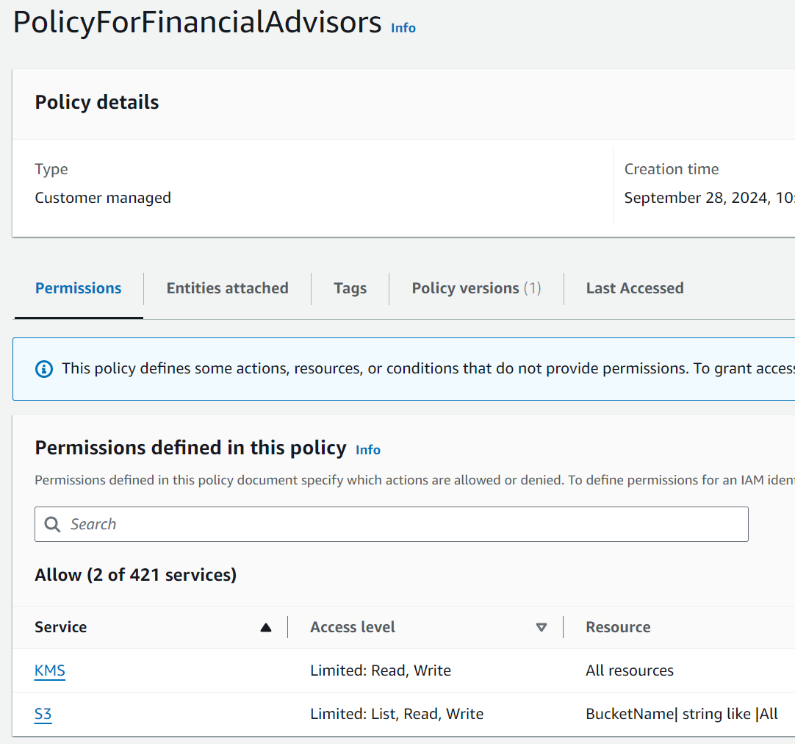

# AWS Academy lab: Securing and Monitoring Resources with AWS

This project is part of the `Cloud Infrastructure Security Course` in the `Cybersecurity Specialization` at [CESAR School](https://cesar.school/).

The tasks are from `AWS Academy` lab: `Securing and Monitoring Resources with AWS`. It focus on securing AWS resources such as S3, VPCs, and implementing encryption with AWS KMS, along with monitoring and logging using AWS CloudTrail, CloudWatch, and AWS Config.

Student: `Pedro Coelho`  
Instructor: `Ioram Sette`

**Table of Contents**

- [AWS Academy lab: Securing and Monitoring Resources with AWS](#aws-academy-lab-securing-and-monitoring-resources-with-aws)
  - [Phase 1: Securing Data in Amazon S3](#phase-1-securing-data-in-amazon-s3)
    - [Task 1.1: Create a bucket, apply a bucket policy, and test access](#task-11-create-a-bucket-apply-a-bucket-policy-and-test-access)
    - [Task 1.2: Enable versioning and object-level logging on a bucket](#task-12-enable-versioning-and-object-level-logging-on-a-bucket)
    - [Task 1.3: Implement the S3 Inventory feature on a bucket](#task-13-implement-the-s3-inventory-feature-on-a-bucket)
    - [Task 1.4: Confirm that versioning works as intended](#task-14-confirm-that-versioning-works-as-intended)
    - [Task 1.5: Confirm object-level logging and query the access logs by using Athena](#task-15-confirm-object-level-logging-and-query-the-access-logs-by-using-athena)
  - [Phase 2: Securing VPCs](#phase-2-securing-vpcs)
    - [Task 2.1: Review LabVPC and its associated resources](#task-21-review-labvpc-and-its-associated-resources)
    - [Task 2.2: Create a VPC flow log](#task-22-create-a-vpc-flow-log)
    - [Task 2.3: Access the WebServer instance from the internet and review VPC flow logs in CloudWatch](#task-23-access-the-webserver-instance-from-the-internet-and-review-vpc-flow-logs-in-cloudwatch)
    - [Task 2.4: Configure route table and security group settings](#task-24-configure-route-table-and-security-group-settings)
    - [Task 2.5: Secure the WebServerSubnet with a network ACL](#task-25-secure-the-webserversubnet-with-a-network-acl)
    - [Task 2.6: Review NetworkFirewallVPC and its associated resources](#task-26-review-networkfirewallvpc-and-its-associated-resources)
    - [Task 2.7: Create a network firewall](#task-27-create-a-network-firewall)
    - [Task 2.8: Create route tables](#task-28-create-route-tables)
    - [Task 2.9: Configure logging for the network firewall](#task-29-configure-logging-for-the-network-firewall)
    - [Task 2.10: Configure the firewall policy and test access](#task-210-configure-the-firewall-policy-and-test-access)
  - [Phase 3: Securing AWS resources by using AWS KMS](#phase-3-securing-aws-resources-by-using-aws-kms)
    - [Task 3.1: Create a customer managed key and configure key rotation](#task-31-create-a-customer-managed-key-and-configure-key-rotation)
    - [Task 3.2: Update the AWS KMS key policy and analyze an IAM policy](#task-32-update-the-aws-kms-key-policy-and-analyze-an-iam-policy)
    - [Task 3.3: Use AWS KMS to encrypt data in Amazon S3](#task-33-use-aws-kms-to-encrypt-data-in-amazon-s3)
    - [Task 3.4: Use AWS KMS to encrypt the root volume of an EC2 instance](#task-34-use-aws-kms-to-encrypt-the-root-volume-of-an-ec2-instance)
    - [Task 3.5: Use AWS KMS envelope encryption to encrypt data in place](#task-35-use-aws-kms-envelope-encryption-to-encrypt-data-in-place)
    - [Task 3.6: Use AWS KMS to encrypt a Secrets Manager secret](#task-36-use-aws-kms-to-encrypt-a-secrets-manager-secret)
  - [Phase 4: Monitoring and logging](#phase-4-monitoring-and-logging)
    - [Task 4.1: Use CloudTrail to record Amazon S3 API calls](#task-41-use-cloudtrail-to-record-amazon-s3-api-calls)
    - [Task 4.2: Use CloudWatch Logs to monitor secure logs](#task-42-use-cloudwatch-logs-to-monitor-secure-logs)
    - [Task 4.3: Create a CloudWatch alarm to send notifications for security incidents](#task-43-create-a-cloudwatch-alarm-to-send-notifications-for-security-incidents)
    - [Task 4.4: Configure AWS Config to assess security settings and remediate the configuration of AWS resources](#task-44-configure-aws-config-to-assess-security-settings-and-remediate-the-configuration-of-aws-resources)


## Phase 1: Securing Data in Amazon S3

### Task 1.1: Create a bucket, apply a bucket policy, and test access


```json
{
    "Version": "2012-10-17",
    "Statement": [
        {
            "Sid": "AllowSpecificPrincipals",
            "Effect": "Allow",
            "Principal": {
                "AWS": [
                    "arn:aws:iam::518337386052:role/voclabs",
                    "arn:aws:iam::518337386052:user/sofia",
                    "arn:aws:iam::518337386052:user/paulo"
                ]
            },
            "Action": "s3:*",
            "Resource": [
                "arn:aws:s3:::data-bucket-01f5a3e8ab0aef64d",
                "arn:aws:s3:::data-bucket-01f5a3e8ab0aef64d/*"
            ],
            "Condition": {
                "ArnEquals": {
                    "aws:PrincipalArn": [
                        "arn:aws:iam::518337386052:user/paulo",
                        "arn:aws:iam::518337386052:user/sofia",
                        "arn:aws:iam::518337386052:role/voclabs"
                    ]
                }
            }
        },
        {
            "Sid": "DenyOtherPrincipals",
            "Effect": "Deny",
            "Principal": "*",
            "Action": "s3:*",
            "Resource": [
                "arn:aws:s3:::data-bucket-01f5a3e8ab0aef64d",
                "arn:aws:s3:::data-bucket-01f5a3e8ab0aef64d/*"
            ],
            "Condition": {
                "ArnNotEquals": {
                    "aws:PrincipalArn": [
                        "arn:aws:iam::518337386052:user/paulo",
                        "arn:aws:iam::518337386052:user/sofia",
                        "arn:aws:iam::518337386052:role/voclabs"
                    ]
                }
            }
        }
    ]
}
```

  

  

### Task 1.2: Enable versioning and object-level logging on a bucket


### Task 1.3: Implement the S3 Inventory feature on a bucket


### Task 1.4: Confirm that versioning works as intended


  

### Task 1.5: Confirm object-level logging and query the access logs by using Athena


## Phase 2: Securing VPCs
### Task 2.1: Review LabVPC and its associated resources  
  
  
  
  

### Task 2.2: Create a VPC flow log


### Task 2.3: Access the WebServer instance from the internet and review VPC flow logs in CloudWatch

  


### Task 2.4: Configure route table and security group settings

  

  

  


### Task 2.5: Secure the WebServerSubnet with a network ACL

  

  

### Task 2.6: Review NetworkFirewallVPC and its associated resources

  


### Task 2.7: Create a network firewall

  

### Task 2.8: Create route tables

  

  

  

### Task 2.9: Configure logging for the network firewall


### Task 2.10: Configure the firewall policy and test access


  


## Phase 3: Securing AWS resources by using AWS KMS
### Task 3.1: Create a customer managed key and configure key rotation

  


### Task 3.2: Update the AWS KMS key policy and analyze an IAM policy

  




### Task 3.3: Use AWS KMS to encrypt data in Amazon S3

  


### Task 3.4: Use AWS KMS to encrypt the root volume of an EC2 instance


### Task 3.5: Use AWS KMS envelope encryption to encrypt data in place


  

  


### Task 3.6: Use AWS KMS to encrypt a Secrets Manager secret


## Phase 4: Monitoring and logging
### Task 4.1: Use CloudTrail to record Amazon S3 API calls


### Task 4.2: Use CloudWatch Logs to monitor secure logs


### Task 4.3: Create a CloudWatch alarm to send notifications for security incidents


### Task 4.4: Configure AWS Config to assess security settings and remediate the configuration of AWS resources


